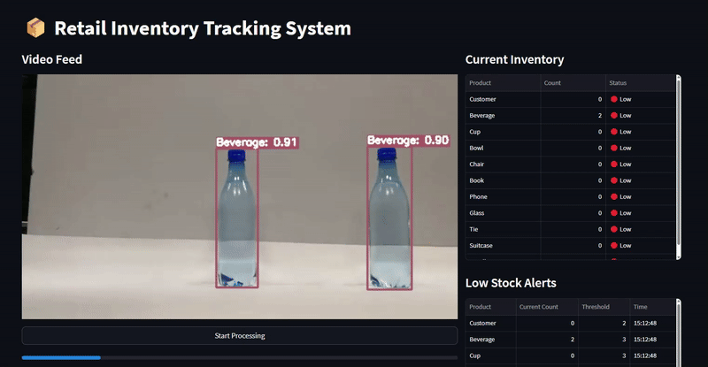

# Retail Inventory Tracking System

A real-time inventory tracking system using YOLOv8 object detection to monitor retail shelves.

## Features
- Product detection using webcam or video files
- Real-time inventory counting
- Low-stock alerts
- Streamlit dashboard
- Daily inventory reports
- Support for multiple input sources (webcam, sample video, or uploaded video)

## Video example



## Try it at : 
(Optimized for running on CPU-only cloud environment)

## Setup
1. Install the required packages:
   ```
   pip install -r requirements.txt
   ```
2. Download a sample video for testing (optional):
   ```
   python download_sample_video.py
   ```
3. Run the application:
   ```
   streamlit run app.py
   ```

## Usage
The application supports three input sources:

1. **Webcam**: Live feed from your camera
   - Select the camera device ID (0, 1, 2, 3)
   - Click "Start Processing" to begin

2. **Sample Video**: Uses the included demo video
   - Download first using `python download_sample_video.py`
   - Select "Sample Video" as input source
   - Click "Start Processing" to begin

3. **Upload Video**: Use your own video file
   - Select "Upload Video" as input source
   - Use the file uploader to select a video (mp4, avi, mov, or mkv)
   - You can use the included `20250403-1312-43.3580260.mp4` sample
   - Click "Start Processing" to begin

## Configuration
Edit the `config.py` file to adjust:
- Detection thresholds
- Product categories
- Low stock alert levels
- Video file path

## PyTorch 2.6 Compatibility
If you encounter model loading issues with PyTorch 2.6, the application includes a fallback mechanism that handles these errors automatically. 
